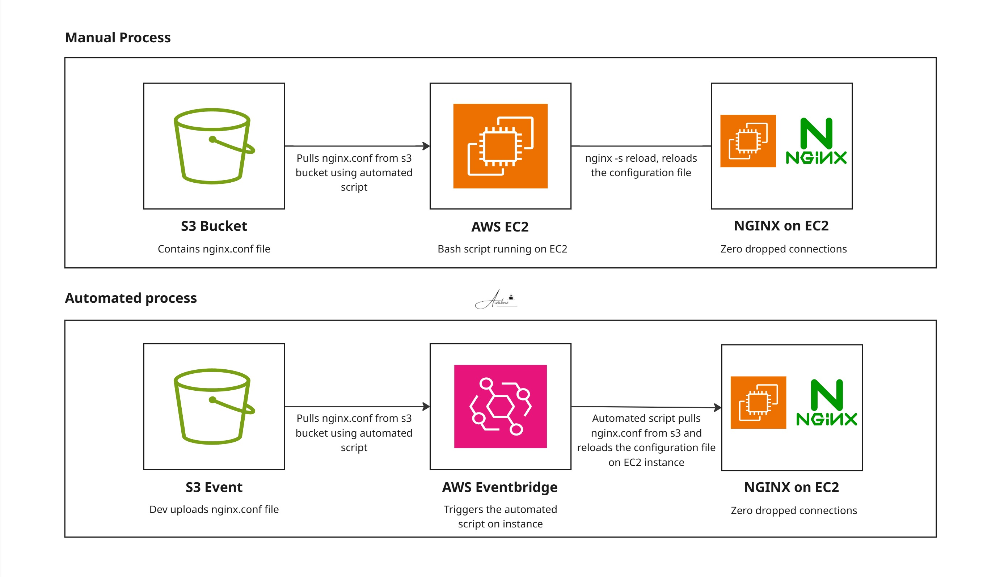

# Project 13: NGINX S3 Config Sync

This Bash script automates NGINX configuration management by pulling the latest `nginx.conf` directly from an Amazon S3 bucket and performing a graceful, zero-downtime reload. Engineered to function as an EC2 user-data bootstrap script or an automated update hook, it eliminates the need for AMI rebuilds or manual SSH interventions when deploying routing or reverse-proxy updates. 

## Architecture



## How It Works

1. **Fetch:** Authenticates via the EC2 Instance Profile to download the canonical `nginx.conf` from `s3://<bucket>/nginx-configs/nginx.conf` directly to `/etc/nginx/nginx.conf`.
2. **Apply:** Executes `nginx -s reload` to hot-swap the new configuration into memory without dropping active client TCP connections.

## Stack

Bash · AWS CLI · NGINX · Amazon S3 · AWS Systems Manager (SSM)

## Prerequisites

- Target EC2 instance with NGINX and the AWS CLI installed.
- An attached IAM Instance Profile with `s3:GetObject` permissions scoped to the target bucket.
- A valid `nginx.conf` present at the configured S3 path.

## Usage

**Local Execution**
Set your target S3 bucket and path within the script, then execute:

```bash
bash nginx.sh
```

**Fleet-Wide Rollout (Zero-Touch)**
To deploy a configuration change across an entire fleet of web servers simultaneously without SSH, use AWS Systems Manager (SSM) Run Command:

```bash
aws ssm send-command \
  --document-name AWS-RunShellScript \
  --targets "Key=tag:App,Values=myapp-web" \
  --parameters 'commands=["sudo bash /opt/nginx-s3-config-sync/nginx.sh"]'
```

*Note: (Optional - but worth it) - This SSM command pairs naturally with an S3 → EventBridge → SSM pipeline for fully automated, event-driven configuration propagation whenever a new `nginx.conf` is uploaded to the bucket.*
